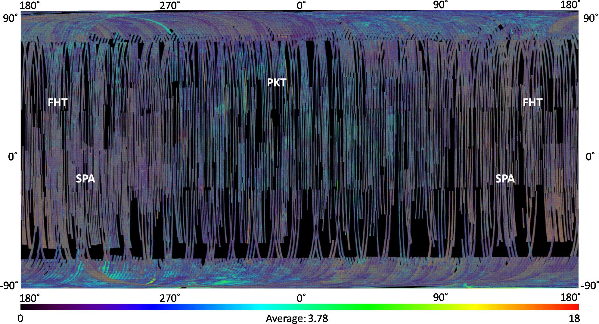
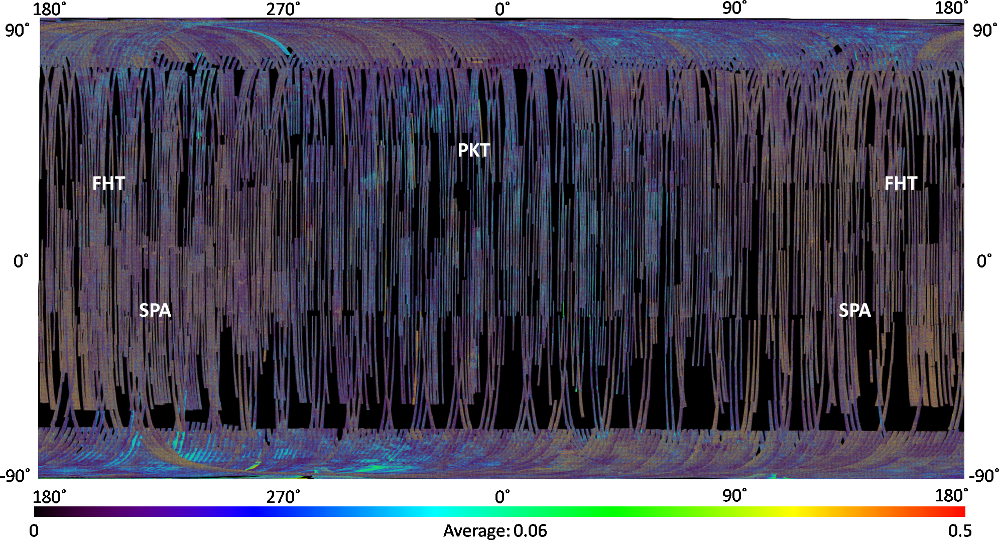

# Radar Backscatter Model
_Inversion model for surface parameter retrieval using deep learning_
---
In this project, we developed an inversion model for extracting the physical
 properties of the surface using deep learning benchmarked against lunar
  sample drive core measurements. 
1. First, we simulated the data for training of the DL model from the
 parameterization of Integral Equation Model (IEM) for rough surfaces. 
  
2. Second, testing was done on the S-band [Mini-RF](https://pds-geosciences.wustl.edu/missions/lro/mrf.htm)  data to retrieve the
  dielectric constant of the lunar surface at global and polar scales.
  
> **Note:** The forward model incorporates the radar backscatter contribution
> from
> the
> subsurface and buried heterogeneities (like volatiles and rocks). We also
> accounted for the differences in the concentration of volatiles by
> modelling the dielectric interface of silicate-ice-helium mixtures.
---
We explicitly tested our model for lunar science application however it is
 possible to transfer and reproduce this algorithm for a diverse range of
earth and planetary science base applications such as:
   * Dielectric Properties
   * Surface roughness 
   * Soil moisture
---
The global dielectric maps of the lunar surface have been generated using
 this model as shown below:
 * ##### Real
 
 * ##### Imaginary
 
 
 
Additionally dielectric maps of the lunar poles have been generated to avoid
  extreme projective distortions in these these regions:
 * ##### North Pole
 
 * ##### South Pole
 
 
 --
 License: [CC-BY](https://creativecommons.org/licenses/by/3.0/)
